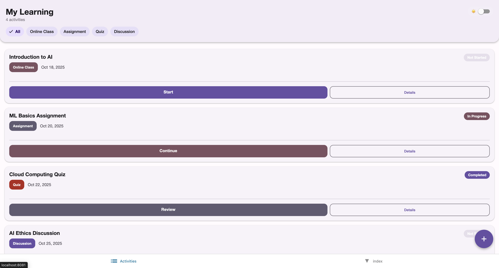
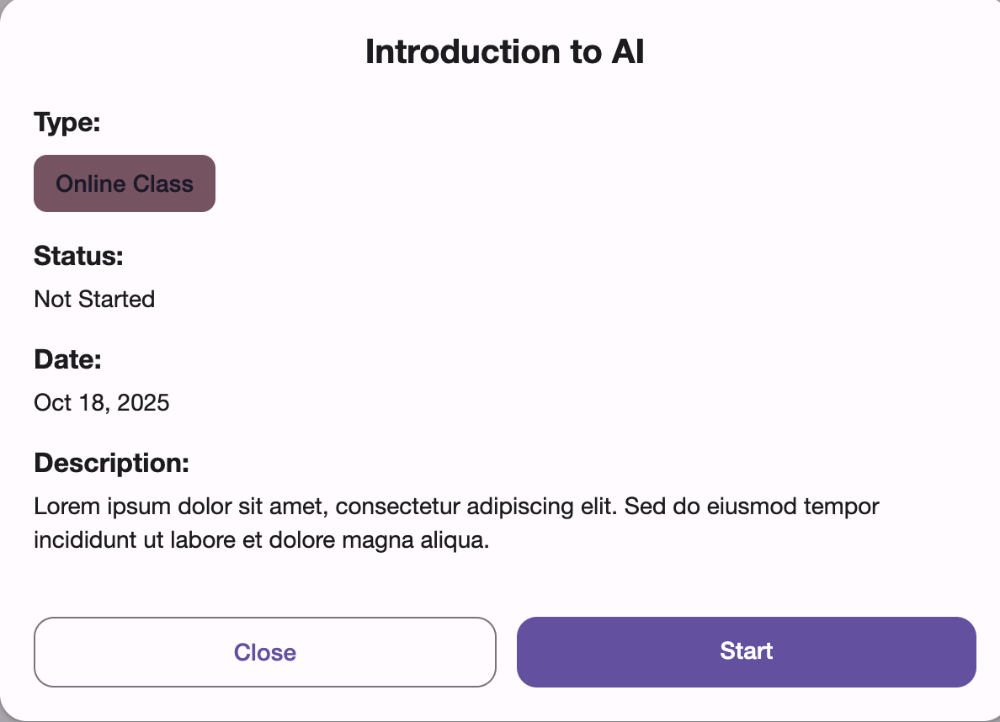
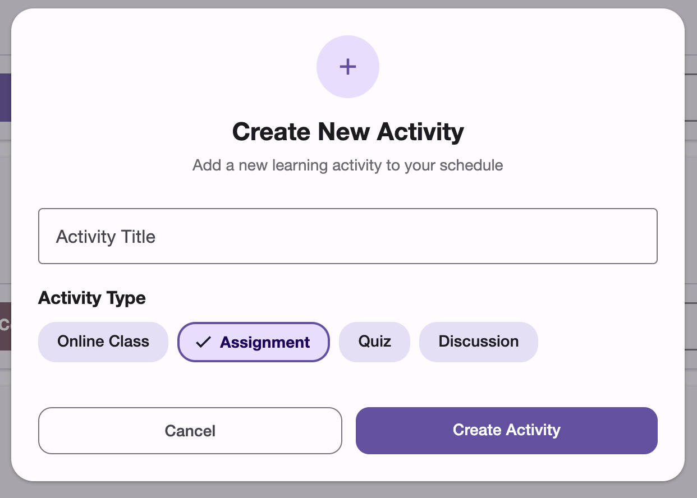
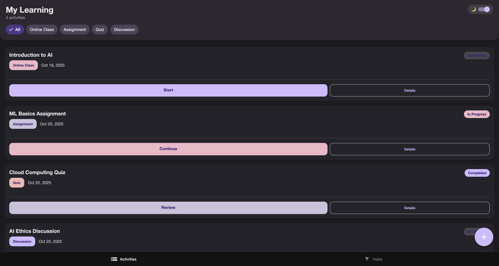

# Activity Listing Application

**A Cross-Platform Educational Management System**

## Project Summary

This project presents a comprehensive cross platform mobile and web application designed for managing learning activities within AI, Machine Learning, and Cloud Computing educational programs. 
The application serves as a centralized platform enabling learners to efficiently organize their academic progress across multiple learning modalities.

## Project Overview

The Activity Listing Application provides learners with an intuitive interface for managing their educational journey through a unified dashboard. The system accommodates various learning formats including online classes, assignments, quizzes, and discussion forums, ensuring comprehensive coverage of modern educational methodologies.

## Technical Specifications

### Core Features

- **Activity Management System**: Comprehensive view of all learning activities presented in an organized, scrollable interface
- **Advanced Filtering Mechanism**: Dynamic filtering capabilities by activity type including Online Class, Assignment, Quiz, and Discussion categories  
- **Action-Oriented User Interface**: Intuitive design providing clear next steps for each activity with Start, Continue, and Review functionalities
- **Detailed Activity Information**: Modal based detailed view system providing comprehensive activity metadata
- **Adaptive Theme System**: Complete light and dark mode implementation with user preference persistence
- **Cross-Platform Compatibility**: Single codebase deployment across web browsers and mobile platforms
- **Responsive Design Architecture**: Optimized user experience across various screen dimensions and device types
- **Activity Creation Interface**: Integrated functionality for adding new learning activities


## Installation and Setup Instructions

### System Requirements
- Node.js version 16 or higher
- Package manager (npm or yarn)
- Expo CLI development tools

### Installation Process

1. **Dependency Installation**
   ```bash
   npm install
   ```

2. **Development Server Initialization**  
   ```bash
   npm run web
   ```

### Platform-Specific Deployment

#### Web Application
```bash
npx expo start --web
```
Alternative: Execute `w` command in terminal after running `npx expo start`

#### iOS Platform
```bash
npx expo start --ios
```
Alternative: Execute `i` command in terminal
*Prerequisites: Xcode and iOS Simulator installation required*

#### Android Platform
```bash
npx expo start --android
```
Alternative: Execute `a` command in terminal
*Prerequisites: Android Studio and Android Emulator configuration required*

## Application Architecture

### Activity Management System
The core functionality revolves around a comprehensive activity listing mechanism that displays educational content in a user friendly card-based layout. Each activity presents essential information including title, type classification, current status, associated dates, and recommended next actions.

### Filtering and Search Infrastructure
The application implements a sophisticated filtering system utilizing chip based interface components, enabling real-time content filtering across multiple activity categories with immediate visual feedback.

### Modal Detail System
A comprehensive modal popup system provides in-depth activity information, ensuring users have access to complete details without navigation disruption.

### Theme Management Architecture
The application incorporates a robust theming system supporting both light and dark modes with persistent state management and automatic system theme detection capabilities.

## Design Rationale and Technical Decisions

### UI Framework Selection: React Native Paper

The selection of React Native Paper as the primary UI library was based on several technical and practical considerations:

- **Material Design 3 Compliance**: Ensures modern, consistent design standards
- **Cross-Platform Optimization**: Native performance across web and mobile platforms  
- **Integrated Theming System**: Built-in support for dynamic theme switching
- **Comprehensive Component Ecosystem**: Extensive library of pre-built, tested components


## Future Development Roadmap

- [ ] Backend API Integration and Data Persistence
- [ ] User Authentication and Authorization System  
- [ ] Advanced Search and Discovery Features


## Application Interface Documentation

The following screenshots demonstrate the application's core functionality and user interface design:

### Primary Dashboard Interface



### Activity Detail Modal
  **Creation Interface**
 **Implementation**
 **Dark-Mode**


---
